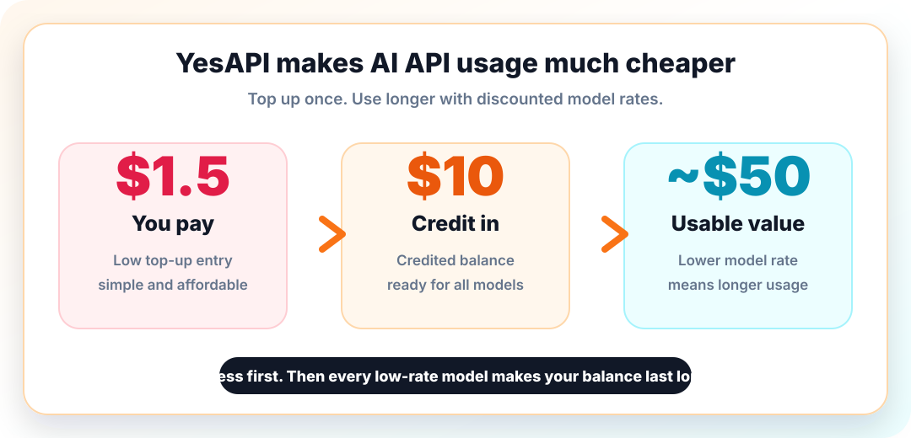
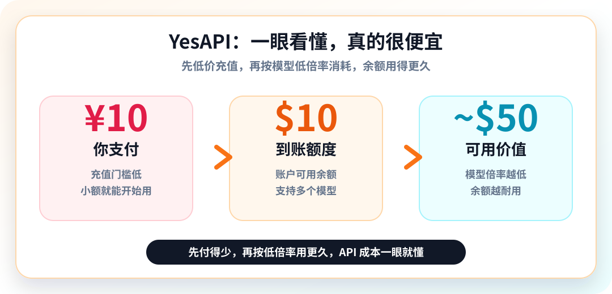

# Free API Proxy & Aggregator for Claude 5, OpenAI GPT-5.6 / GPT-5o, and DeepSeek

<p align="center">
  <a href="#english">English</a>
  &nbsp;|&nbsp;
  <a href="#chinese-document">中文</a>
</p>

<p align="center">
  <a href="https://yesapi.online">
    
  </a>
  <a href="https://yesapi.online">
    
  </a>
  <a href="https://yesapi.online">
    
  </a>
  <a href="https://yesapi.online">
    
  </a>
</p>

<div align="center">

## Very Cheap AI API Access / 超低价 API 中转

### Top up cheaply first. Then use longer with lower model rates.

### 先低价充值，再按模型低倍率用得更久

<p align="center">
  
</p>

<p align="center">
  
</p>

| Step | English | 中文 |
| :--- | :--- | :--- |
| **1. Top-up** | **Pay $1.5 -> get $10.00 credited** | **支付 ¥10.00 -> 到账 $10.00 额度** |
| **2. Usage** | Spend is discounted again by model rate. Lower rate = longer use. | 调用时再按模型倍率折扣。倍率越低，余额越耐用。 |
| **3. Result** | Small payment, more API calls, longer coding and agent usage. | 小额充值，更多调用，代码补全和 Agent 用得更久。 |

[Start Free Trial](https://yesapi.online) - [View Documentation](https://yesapi.online/docs)

</div>

---

<a id="english"></a>

## English

YesAPI is a high-speed, stable, and ultra-affordable API proxy and LLM aggregation gateway for developers, startups, and global teams.

It is compatible with official OpenAI and Anthropic SDKs, and works smoothly with popular AI coding tools including Cursor, Windsurf, and Trae.

### Why YesAPI

| Advantage | Details |
| :--- | :--- |
| **Top up cheaply** | **Pay $1.5 and get $10.00 credited**, with slight promotional variance. |
| **Use longer** | Your credited balance is discounted again by each model rate. Lower model rate means lower spend. |
| **Ultra-low cost** | API usage can be far cheaper than direct official pricing, especially on low-rate models. |
| **High-speed access** | Multi-region route optimization helps reduce latency for coding, chat, and agent workflows. |
| **Stable infrastructure** | PostgreSQL, Redis cache, and Cloudflare DDoS protection improve reliability and uptime. |
| **Universal balance** | One balance can be used across all supported models. |
| **Flexible payments** | Supports credit cards, crypto payments in USD, and local CNY recharge options. |

### Cheap Pricing Mechanics

| Stage | Example | Meaning |
| :--- | :--- | :--- |
| **1. Top-up** | **Pay $1.5 -> get $10.00 credited** | Your entry cost is low from the start. Actual promotion may vary slightly. |
| **2. Usage** | Balance is consumed by model rate | The lower the model rate, the longer your balance lasts. |
| **3. Model switching** | Use one balance across supported models | Claude 5, GPT-5.6, GPT-5o, DeepSeek, and more. |

### Supported Models

| Provider | Model ID | Core Capability | Context Window |
| :--- | :--- | :--- | :--- |
| **Anthropic** | `claude-opus-5` / `claude-sonnet-5` | Frontier agentic coding and adaptive thinking | 1M |
| **OpenAI** | `gpt-5.6-sol` / `gpt-5.6-terra` | Flagship reasoning and advanced agent workflows | 1.05M |
| **OpenAI** | `gpt-5o` / `gpt-5o-mini` | Low-latency multimodal and everyday knowledge work | 256k |
| **DeepSeek** | `deepseek-chat` / `deepseek-coder` | Efficient budget coding and fast inference | 128k |

### Quick Integration

#### Cursor IDE

1. Open Cursor settings.
2. Go to **Models** and find **OpenAI API Key**.
3. Set **Base URL** to:

```text
https://yesapi.online/v1
```

4. Enter your YesAPI key and start using supported models.

#### NextChat, LobeChat, One-API

| Field | Value |
| :--- | :--- |
| API Host | `https://yesapi.online` |
| Secret Key | Your YesAPI key, such as `sk-...` |

#### Python SDK Example

```python
import openai

client = openai.OpenAI(
    base_url="https://yesapi.online/v1",
    api_key="your-yesapi-key",
)

response = client.chat.completions.create(
    model="claude-sonnet-5",
    messages=[
        {"role": "user", "content": "Hello YesAPI"}
    ],
)

print(response.choices[0].message.content)
```

### FAQ

#### How does the pricing multiplier work?

YesAPI uses a two-stage discount model. First, you can pay **$1.5** and get **$10.00 credited** with slight promotional variance. Then, usage is discounted again by each model rate, so lower-rate models make the same balance last longer.

#### Is this API proxy safe and private?

YesAPI uses SSL encrypted transmission and follows a no-logs policy for request and response bodies.

#### How can I get a free test API key?

Register at [yesapi.online](https://yesapi.online) to receive free test quota.

---

<a id="chinese-document"></a>

## 中文

YesAPI 是一个高速、稳定、极具性价比的 AI API 中转站与大模型聚合网关，适合开发者、创业团队和企业团队使用。

它兼容 OpenAI 与 Anthropic 官方 SDK，并可用于 Cursor、Windsurf、Trae 等主流 AI 编程工具。

### 价格优势一眼看懂

| 价格亮点 | 说明 |
| :--- | :--- |
| **1. 充值先便宜** | **支付 ¥10.00 -> 到账 $10.00 额度**，活动可能有轻微浮动。 |
| **2. 使用更耐用** | 调用模型时还会按模型倍率再次折扣，倍率越低越省。 |
| **余额用得更久** | 同样的余额可以支撑更多代码补全、Agent、聊天机器人和高频 API 调用。 |
| **全站通用余额** | 一个余额可用于 Claude、OpenAI、DeepSeek 等支持模型。 |
| **成本一眼看懂** | 先看充值到账，再看模型倍率，低倍率模型最划算。 |

### 为什么选择 YesAPI

| 优势 | 说明 |
| :--- | :--- |
| **充值门槛低** | **支付 ¥10.00，即可到账 $10.00 额度**，活动可能有轻微浮动。 |
| **使用时再省一次** | 实际消耗按模型倍率计算，倍率越低，余额越耐用。 |
| **极低调用成本** | 低倍率模型可以显著降低实际 API 调用成本。 |
| **极速低延迟** | 多机房线路优化，提升 Cursor、Windsurf、Trae 等工具的响应速度。 |
| **高可用架构** | PostgreSQL、Redis 缓存、Cloudflare 高防共同保障稳定性。 |
| **余额全站通用** | 账户余额可无缝用于所有支持的大模型。 |
| **支付方式灵活** | 支持美元信用卡、加密货币，以及人民币充值方式。 |

### 便宜机制说明

| 阶段 | 示例 | 含义 |
| :--- | :--- | :--- |
| **1. Top-up 充值** | **支付 ¥10.00 -> 到账 $10.00 额度** | 先用很低门槛获得可用 API 余额，活动可能有轻微浮动。 |
| **2. Usage 使用** | 按模型倍率消耗余额 | 倍率越低，实际消耗越少，余额用得越久。 |
| **3. 通用余额** | 一个余额用于多个模型 | Claude 5、GPT-5.6、GPT-5o、DeepSeek 等都可使用。 |

### 支持模型

| 提供商 | 模型 ID | 核心能力 | 上下文窗口 |
| :--- | :--- | :--- | :--- |
| **Anthropic** | `claude-opus-5` / `claude-sonnet-5` | 前沿 Agent 编程与自适应推理 | 1M |
| **OpenAI** | `gpt-5.6-sol` / `gpt-5.6-terra` | 旗舰推理与复杂 Agent 工作流 | 1.05M |
| **OpenAI** | `gpt-5o` / `gpt-5o-mini` | 低延迟多模态与日常任务处理 | 256k |
| **DeepSeek** | `deepseek-chat` / `deepseek-coder` | 高性价比编程与极速推理 | 128k |

### 快速接入

#### Cursor IDE

1. 打开 Cursor 设置。
2. 进入 **Models**，找到 **OpenAI API Key**。
3. 将 **Base URL** 修改为：

```text
https://yesapi.online/v1
```

4. 填入你的 YesAPI API Key 即可开始使用。

#### NextChat / LobeChat / One-API

| 配置项 | 内容 |
| :--- | :--- |
| API 接口地址 | `https://yesapi.online` |
| 密钥 | 你的 YesAPI Key，例如 `sk-...` |

#### Python SDK 示例

```python
import openai

client = openai.OpenAI(
    base_url="https://yesapi.online/v1",
    api_key="your-yesapi-key",
)

response = client.chat.completions.create(
    model="claude-sonnet-5",
    messages=[
        {"role": "user", "content": "Hello YesAPI"}
    ],
)

print(response.choices[0].message.content)
```

### 常见问题

#### 倍率折算机制是怎么计算的？

YesAPI 采用两层省钱机制。第一层是充值：**支付 ¥10.00，可到账 $10.00 额度**，活动可能有轻微浮动。第二层是使用：调用模型时会按模型倍率消耗余额，倍率越低，实际消耗越少，余额用得越久。

#### 中转站安全且隐私吗？

YesAPI 使用 SSL 加密传输，并遵循请求体与响应体无日志政策。

#### 如何领取免费测试额度？

访问 [yesapi.online](https://yesapi.online) 注册账号，即可领取免费测试额度。

---

## Resources

| Resource | Link |
| :--- | :--- |
| Website | [https://yesapi.online](https://yesapi.online) |
| Documentation | [https://yesapi.online/docs](https://yesapi.online/docs) |
